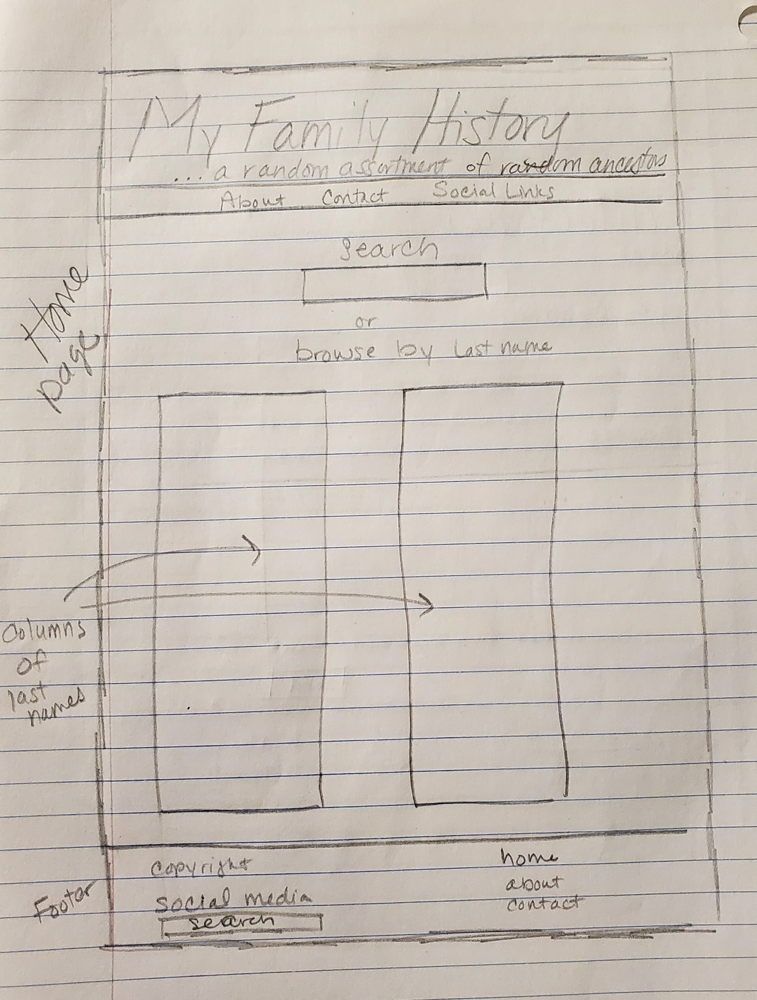
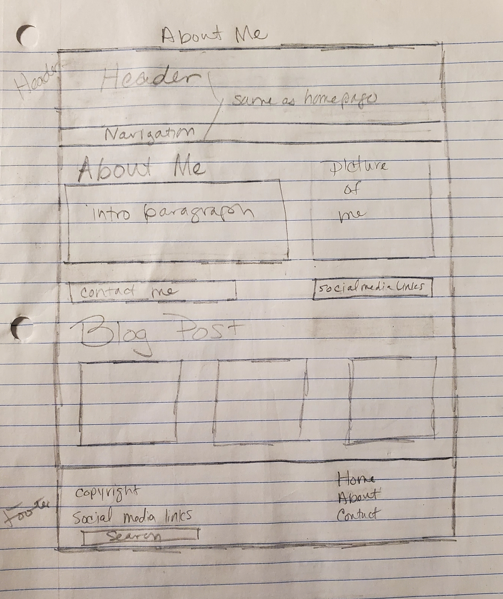
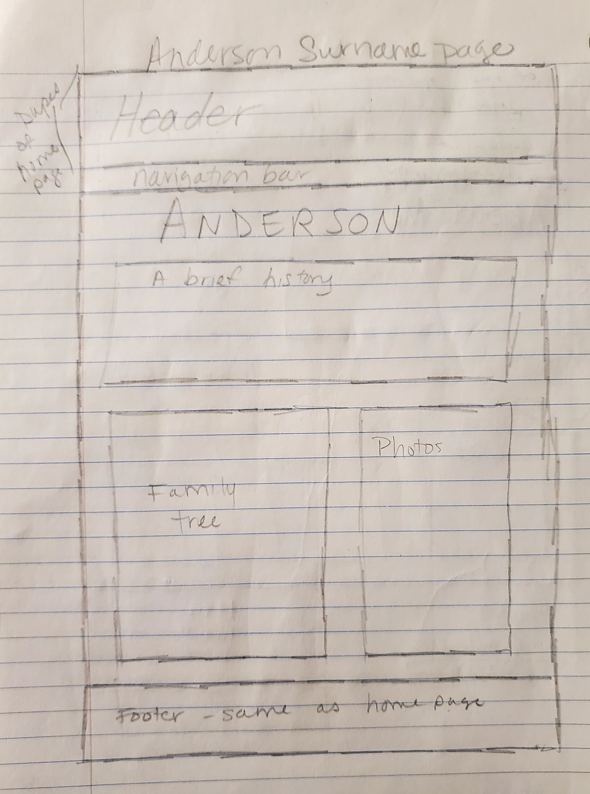

# Rachel Anderson's INF6420 Project

A family history website for my family

## wireframes

Header -will include Title and my name

Navigation Menu -will include links to other pages like an About Me page and social media links

Main content -will include a search box and lists of family names with content on the site

Footer -will include copyright information and site navigation links

Header -will include Title and my name

Navigation Menu -will include links to other pages like an About Me page and social media links

Main content -will include introdcution, contact information, and blog posts

Footer -will include copyright information and site navigation links

Header -will include Title and my name

Navigation Menu -will include links to other pages like an About Me page and social media links

Main content -will include Surname as h2, a brief history, a pedigree, and photos

Footer -will include copyright information and site navigation links